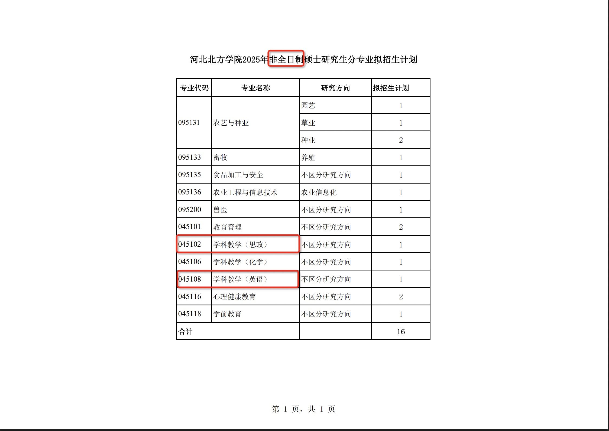
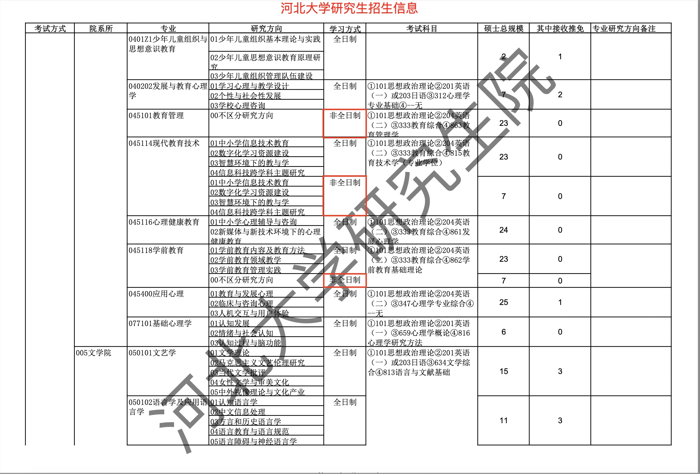
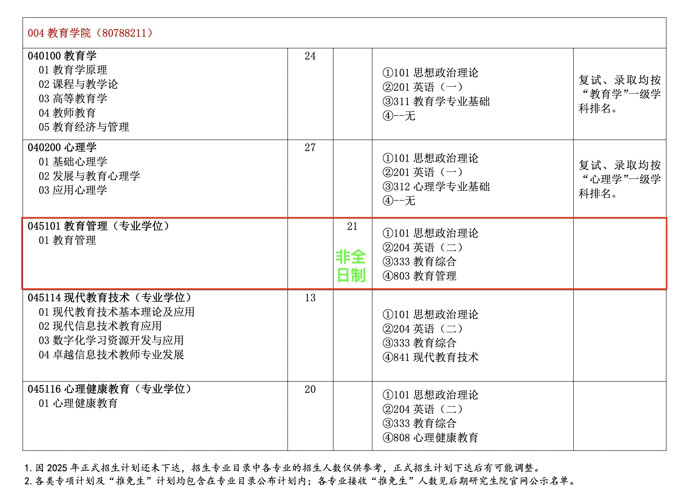
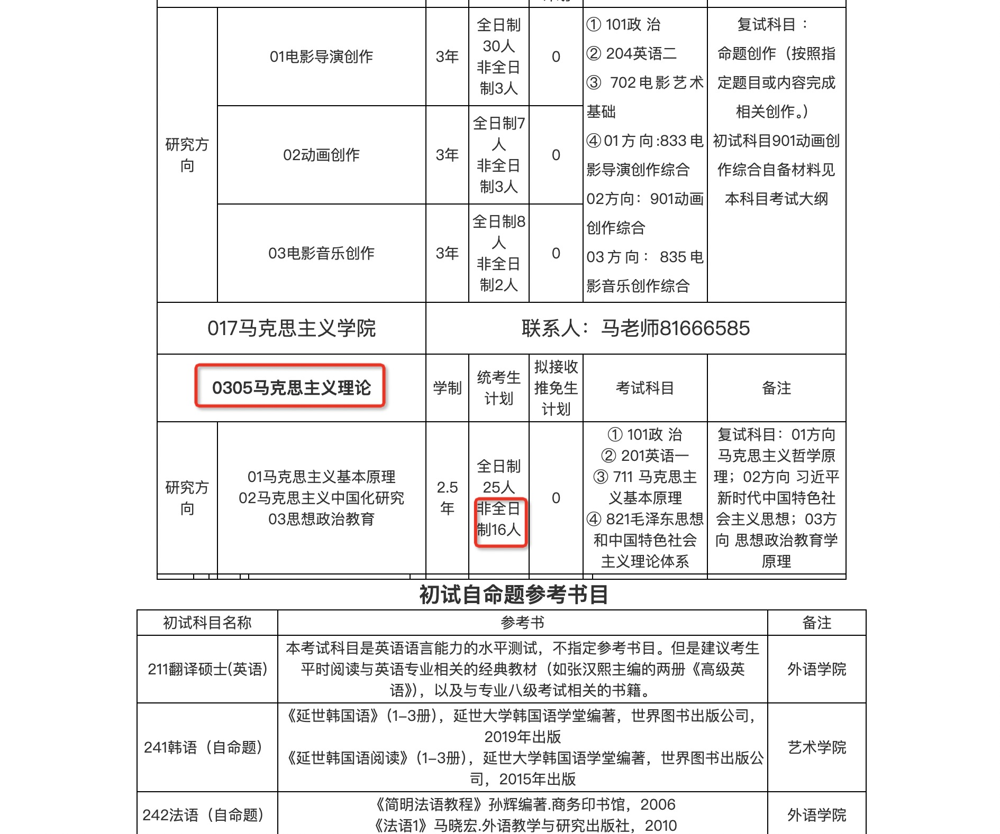
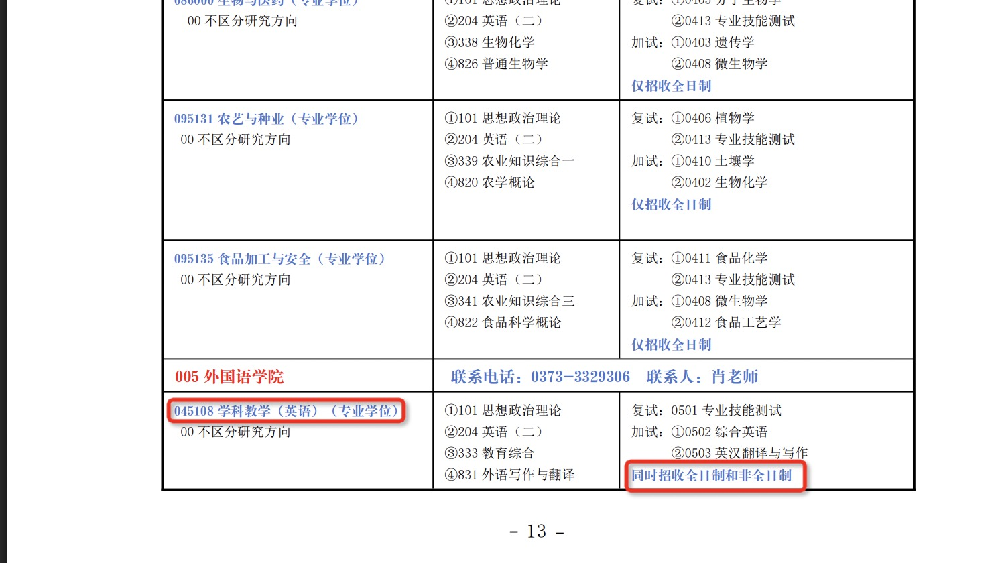
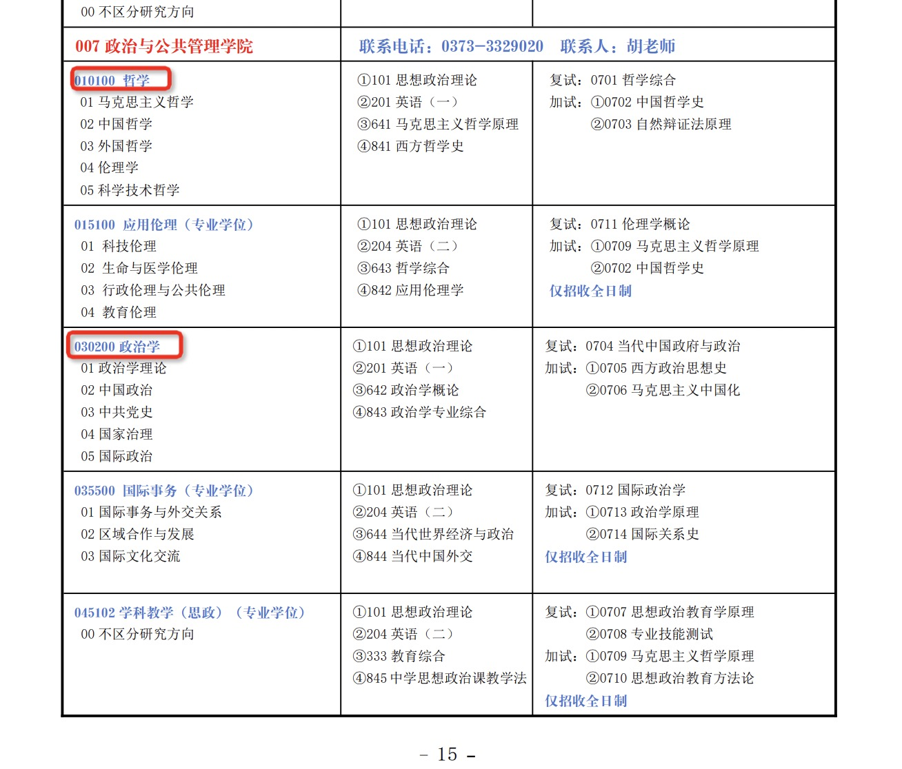

# 2025年河北师范大学研究生招生信息

|   学校名字   |                      官网地址                      |                         招生简章地址                         |                       非全日制专业图示                       | 所在省市       |
| :----------: | :------------------------------------------------: | :----------------------------------------------------------: | :----------------------------------------------------------: | -------------- |
| 河北北方学院 |        [官网](https://www.hebeinu.edu.cn/)         | [招生计划](https://yjs.hebeinu.edu.cn/index.php?s=/Show/index/cid/11/id/301.html) |                              | 河北省张家口市 |
|   河北大学   |            [官网](https://hbu.edu.cn/)             |    [招生简章](https://yjsy.hbu.edu.cn/info/1102/3560.htm)    |                              | 河北省保定市   |
| 河北师范大学 |         [官网](https://www.hebtu.edu.cn/)          | [招生简章](https://yjsy.hebtu.edu.cn/a/2024/10/07/B0869136E1D647E48E2726A30A44EA46.html) |                              | 河北省石家庄市 |
| 洛阳师范学院 | [官网](https://sites.lynu.edu.cn/yjs_xk/index.htm) | [招生简章](https://sites.lynu.edu.cn/yjs_xk/info/1004/1778.htm) |                     官网图片失效看不到了                     | 河南省洛阳市   |
| 河北科技大学 | [官网](https://yjsxy.web.hebust.edu.cn/index.htm)  | [招生简章](https://yjsxy.web.hebust.edu.cn/zsgz/zsjz/7221ce048ad143f48890b200cd5e8f90.htm) |                                | 河北省石家庄市 |
| 河南师范大学 |                                                    |                                                              |  |                |
|              |                                                    |                                                              |                                                              |                |

